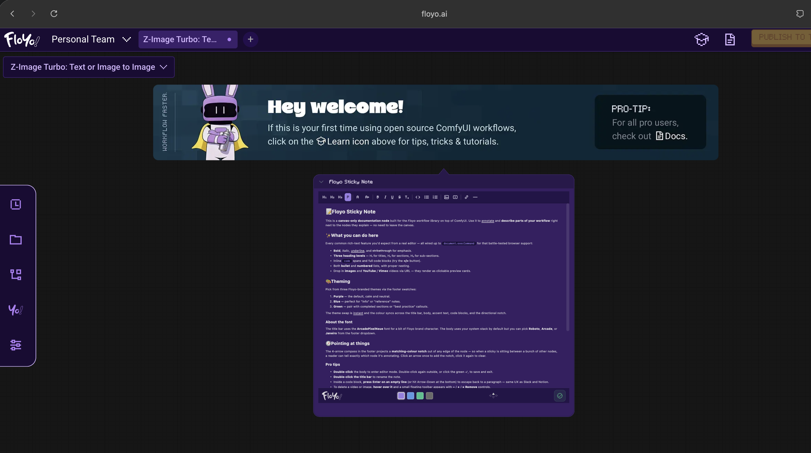

# Floyo Sticky Note

A rich-text sticky-note node for **ComfyUI**. Drop it onto the canvas to
document and annotate your workflows right next to the nodes they explain.
Carries no inputs or outputs, so the prompt queue skips it at run time —
it exists purely as visual documentation on the graph.



---

## Features

- **Three visual states**
  - **Display** — read-only rendered content with the header, body, and
    optional direction notch.
  - **Editor** — full rich-text editing with a formatting toolbar and
    theme/font/save controls in the footer.
  - **Collapsed** — only the title bar is shown; click the chevron in the
    title bar to expand back.

- **Rich-text formatting**
  - Three heading levels (H₁, H₂, H₃).
  - Bold, italic, underline, strikethrough.
  - Clear formatting (`Tₓ`).
  - Inline `code` spans and fenced code blocks.
  - Bullet lists and numbered lists.

- **Media embeds**
  - **Images** by URL (a small popup asks for the URL).
  - **Videos** from **YouTube** and **Vimeo** — paste the URL and the
    note renders a thumbnail with a play button; click the thumbnail to
    load the video player inline.

- **Three themes** — Purple (default), Blue, Green. Switch from the
  swatches in the footer; the title bar, body, accent colours, code
  blocks, and direction notch all re-tint together.

- **Font picker** — Default (system), Roboto, Arcade, Janeiro. Choose
  from the dropdown in the footer.

- **Direction notch** — A four-way compass in the footer lets you
  project a triangular notch out of any edge of the node, so a reader
  knows which neighbouring node the sticky is annotating.

- **Editable title** — Double-click the title bar to rename the note.

- **Resizable** — Drag the standard LiteGraph resize handle to make the
  note larger or smaller; the content and footer reflow automatically.

- **Persistent** — All state (title, content, theme, font, pointer
  direction) is saved with the workflow JSON. Reload the workflow and
  the note returns exactly as you left it.

---

## Installation

### Option A — Clone with Git

```bash
cd /path/to/ComfyUI/custom_nodes
git clone https://github.com/FloyoAI/Floyo-Sticky-Note.git
```

Restart ComfyUI. The node appears under
**Add Node → Floyo → Notes → 📝 Floyo Sticky Note**.

### Option B — Manual download

1. Download this repository as a ZIP from GitHub.
2. Extract it into your ComfyUI `custom_nodes/` directory.
3. Restart ComfyUI.

### Updating

```bash
cd /path/to/ComfyUI/custom_nodes/Floyo-Sticky-Note
git pull
```

Then restart ComfyUI and hard-refresh your browser
(`Cmd+Shift+R` on macOS, `Ctrl+Shift+R` on Windows/Linux) so the new
front-end JavaScript is loaded.

---

## How to use

### Add a note

Right-click an empty area of the canvas (or use the search/Add Node
menu) and pick **Floyo → Notes → 📝 Floyo Sticky Note**. A new note
appears with a sample of every formatting feature, so you can see what
each control does at a glance.

### Edit the content

**Double-click anywhere inside the body** to enter editor mode. The
formatting toolbar appears at the top of the body and the controls
footer appears at the bottom.

### Formatting toolbar

The toolbar runs left-to-right with three groups:

| Group   | Buttons                                              |
| ------- | ---------------------------------------------------- |
| Headings| H₁, H₂, H₃ — apply heading 1, 2, or 3 to the current line. |
| Inline  | **B** (bold), *I* (italic), <u>U</u> (underline), ~~S~~ (strikethrough), **Tₓ** (clear formatting). |
| Blocks  | `< >` (code block), bullet list, numbered list, image, video. |

Selection-based — pick text first, then click the formatting button.
For block-level buttons (headings, lists, code), placing the cursor on
a line is enough.

### Inserting images

Click the **image** button on the toolbar. A small popup appears.
Paste any image URL (HTTPS recommended) and click **OK**. The image
is inserted at the cursor position; you can keep typing immediately
below it.

### Inserting videos

Click the **video** button. Paste a YouTube or Vimeo URL. Both
short-form (`youtu.be/...`) and long-form (`youtube.com/watch?v=...`)
YouTube URLs are supported; for Vimeo, any `vimeo.com/<id>` URL works.

The video is inserted as a **preview card** showing the thumbnail and
a play button. The actual video player only loads when you click play
— so notes with several embedded videos still open quickly.

### Resizing or removing images and videos

Hover over any inserted image or video. A small floating toolbar
appears in the upper-right corner of the media:

- **−** make the media smaller (in 10% steps).
- **+** make the media bigger (capped at the body width).
- **× Remove** delete the media.

### Title

The title sits in the bar at the top of the note. **Double-click**
the title bar to open an inline rename prompt.

### Themes

Three theme swatches sit in the footer between the logo and the font
picker. Click a swatch to switch the entire note (header, body,
accent, code, notch) to that theme.

### Font

The dropdown to the right of the theme swatches sets the font for the
body text. The default uses your system stack; Roboto, Arcade, and
Janeiro are alternative options. Custom fonts (Arcade, Janeiro) need
to be available on the host machine for the browser to render them;
otherwise the system default is used.

### Direction notch (pointer)

The compass icon next to the save button has four arrow paths — up,
down, left, right. Click any arrow to add a triangular notch
protruding from that edge of the node, indicating which neighbouring
node the sticky is annotating. Click the same arrow again to clear
the notch.

### Collapsing the note

Click the small chevron icon (▼) in the upper-right corner of the
title bar. The note collapses to just the title bar. Click the
chevron again (▶) to expand it back. Useful when many notes are
crowding the canvas.

### Saving and exiting editor mode

- Click the **green ✓** button in the footer.
- Or click **anywhere on the canvas** outside the note.

Either action saves your changes and returns the note to display
mode. Your edits persist with the workflow JSON.

---

## Tips

- **Type below media without effort.** When you insert an image or
  video, a fresh paragraph is created right after it and the cursor
  is placed inside — start typing immediately.
- **Escape a code block.** Inside a fenced code block, press **Enter**
  on an empty line to escape back to a normal paragraph. You can
  also use **Arrow Down** when the cursor is at the end of the block
  or **Arrow Up** at the start.
- **Selection is preserved across the URL popups.** Wherever your
  cursor was in the body, the image or video lands at that position
  when you confirm the popup.

---

## Troubleshooting

**The node doesn't appear in the Add Node menu.**
Check the terminal where ComfyUI is running. Python import errors are
printed there; the most common cause is the package being one level
too deep inside `custom_nodes/`. The directory you cloned should be a
**direct child** of `custom_nodes/`.

**The node appears but looks unstyled (plain grey).**
Your browser is serving a cached older version of the front-end
JavaScript. Open DevTools (F12), check **Disable cache** in the
Network tab, then hard-refresh the page.

**The custom fonts (Arcade, Janeiro) aren't applied.**
These are Floyo brand fonts. The package ships **Arcade Pixel Neue**
(used for the title bar) inside the `web/assets/` folder, so it
always works. Arcade and Janeiro selected from the **body** font
picker need to be installed on the host machine; otherwise the
browser falls back to the system stack.

**The video shows "Video unavailable".**
Some YouTube videos disable embedding. The thumbnail will still
appear; clicking the play button replaces the thumbnail with the
embedded player. If the embedded player refuses to load, open the
original URL on YouTube directly.

---

## What it doesn't do

This node is purely a canvas-side documentation artifact. It has
**no inputs and no outputs**, contributes nothing to the prompt
queue, and produces no images, latents, or tensors. Think of it as
the ComfyUI equivalent of a comment block in source code — useful
for the humans reading the workflow, invisible to the run-time
execution graph.

---

## License

MIT.
